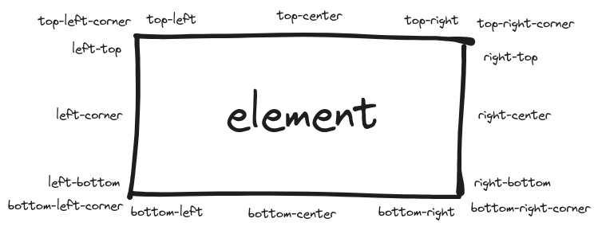

<p>
  
</p>

# solidiform

[](https://pnpm.io/)



## Quick start

### Installation:

```bash
npm i solidiform
# or
yarn solidiform
# or
pnpm add solidiform
```

### [Demo here!](https://funny-family.github.io/solidiform/)

---

### Setup:

```ts
import { type TooltipDirective, tooltip } from 'solidiform';
import 'solidiform/styles.css';

// https://github.com/solidjs/solid/discussions/845
tooltip;

declare module 'solid-js' {
  namespace JSX {
    interface Directives extends TooltipDirective {}
  }
}
```

### Examples:

```tsx
import { tooltip, Tooltip } from 'solidiform';

...

<p
  use:tooltip={{
    tooltips: [
      {
        element: (
          <Tooltip class="tooltip">
            What...
          </Tooltip>
        ),
        position: 'top-center',
      },
    ],
  }}
  tabIndex={0}
>
  This is bla, bla, bla and bla...
</p>
```

```tsx
import { tooltip, Tooltip } from 'solidiform';

...

<p
  use:tooltip={{
    tooltips: [
      {
        element: (
          <Tooltip class="tooltip">
            What...
          </Tooltip>
        ),
        position: 'top-center',
      },
      {
        element: (
          <Tooltip class="tooltip">
            is ... this...
          </Tooltip>
        ),
        position: 'right-center',
      },
    ],
  }}
  tabIndex={0}
>
  Etiam dictum eleifend justo, sit amet porttitor lectus ullamcorper eget. Morbi
  aliquet, nibh non porta euismod, metus est tincidunt ex, id vehicula massa
  metus id arcu. Nunc quis tincidunt metus, eu dapibus ligula.
</p>
```

```tsx
import { tooltip, Tooltip } from 'solidiform';

...

<p
  class="highlight-text"
  use:tooltip={{
    tooltips: [
      {
        element: (
          <Tooltip class="tooltip">
            Hey! I am describing something...
          </Tooltip>
        ),
        displayOnHover: false,
      },
    ],
    onFocusin: (event) => {
      console.log('"focusin" event:"', event);
    },
  }}
  tabIndex={0}
>
  Maecenas blandit arcu eget rutrum sodales. Vestibulum tempor mi nec metus
  elementum fermentum. Aenean a gravida justo, nec pharetra massa.
</p>
```

```tsx
import { type TooltipComponent, Tooltip as BaseTooltip } from 'solidiform';
import 'styles.css';

// You can use "Tooltip" component as base for your custom tooltip.
export const Tooltip: TooltipComponent = (props) => {
  return (
    <BaseTooltip {...props} class={`${props?.class || ''} tooltip`}>
      <div>
        <div>
          ...
        </div>
      </div>
    </BaseTooltip>
  )
};

...

import { tooltip } from 'solidiform';
import { Tooltip } from './custom-tooltip-component-from-somewhere';

<p
  use:tooltip={{
    tooltips: [
      {
        element: (
          <Tooltip>
            Hey! I am describing something...
          </Tooltip>
        ),
        displayOnHover: false,
      },
    ],
    onFocusin: (event) => {
      console.log('"focusin" event:"', event);
    },
  }}
  tabIndex={0}
>
  Lorem ipsum dolor sit amet consectetur adipisicing elit. Eaque, suscipit?
</p>
```

### Component API:

`Tooltip` component has the same attributes and events as `HTMLDivElement` and serves as a base for your custom tooltip.

#### Default props:

| Prop name                      | Type      | Description                                                                                               | Default value       |
| ------------------------------ | --------- | --------------------------------------------------------------------------------------------------------- | ------------------- |
| `class`                        | `string`  | [read on MDN](https://developer.mozilla.org/en-US/docs/Web/HTML/Global_attributes/class)                  | `'solidiform'`      |
| `role`                         | `string`  | [read on MDN](https://developer.mozilla.org/en-US/docs/Web/Accessibility/ARIA/Roles/tooltip_role)         | `'tooltip'`         |
| `tabindex`                     | `number`  | [read on MDN](https://developer.mozilla.org/en-US/docs/Web/HTML/Global_attributes/tabindex)               | `-1`                |
| `inert`                        | `boolean` | [read on MDN](https://developer.mozilla.org/en-US/docs/Web/HTML/Global_attributes/inert)                  | `true`              |
| `aria-label`                   | `string`  | [read on MDN](https://developer.mozilla.org/en-US/docs/Web/Accessibility/ARIA/Attributes/aria-label)      | `'tooltip'`         |
| `aria-labelledby`              | `string`  | [read on MDN](https://developer.mozilla.org/en-US/docs/Web/Accessibility/ARIA/Attributes/aria-labelledby) | `'tooltip'`         |
| `aria-hidden`                  | `boolean` | [read on MDN](https://developer.mozilla.org/en-US/docs/Web/Accessibility/ARIA/Attributes/aria-hidden)     | `true`              |
| `data-tooltip-sr-notification` | `string`  | Data attribute that notifies the screen reader user that this element has a tooltip.                      | `'; Has tooltip: '` |

### Directive API:

| Option name    | Type                      | Description                                                                                                                                                       |
| -------------- | ------------------------- | ----------------------------------------------------------------------------------------------------------------------------------------------------------------- |
| `tooltips`     | `object`                  | Array of options for each defined tooltip.                                                                                                                        |
| `onMouseEnter` | `function` or `undefined` | Event that occurs when the mouse pointer enters an element. [(reference)](https://developer.mozilla.org/en-US/docs/Web/API/EventTarget/addEventListener#listener) |
| `onMouseLeave` | `function` or `undefined` | Event that occurs when the mouse pointer leaves an element. [(reference)](https://developer.mozilla.org/en-US/docs/Web/API/EventTarget/addEventListener#listener) |
| `onFocusIn`    | `function` or `undefined` | Event that occurs when an element gets focus. [(reference)](https://developer.mozilla.org/en-US/docs/Web/API/EventTarget/addEventListener#listener)               |
| `onFocusOut`   | `function` or `undefined` | Event that occurs when an element loses focus. [(reference)](https://developer.mozilla.org/en-US/docs/Web/API/EventTarget/addEventListener#listener)              |

#### `tooltips` option:

| Option name      | Type                                                                                                                                                                                                                                                                                           | Description                                                                                     |
| ---------------- | ---------------------------------------------------------------------------------------------------------------------------------------------------------------------------------------------------------------------------------------------------------------------------------------------- | ----------------------------------------------------------------------------------------------- |
| `element`        | `object`                                                                                                                                                                                                                                                                                       | Element used as a tooltip.                                                                      |
| `position`       | `top-left-corner` or `top-left` or `top-center` or `top-right` or `top-right-corner` or `right-top` or `right-center` or `right-bottom` or `bottom-right-corner` or `bottom-right` or `bottom-center` or `bottom-left` or `bottom-left-corner` or `left-bottom` or `left-center` or `left-top` | Tooltip position. By default it is `top-left` position.                                         |
| `displayOnHover` | `boolean` or `undefined`                                                                                                                                                                                                                                                                       | Controls whether a tooltip is displayed when hovering over an element. Bu default is is `true`. |
| `displayOnFocus` | `boolean` or `undefined`                                                                                                                                                                                                                                                                       | Controls whether a tooltip is displayed when focusing over an element. Bu default is is `true`. |
